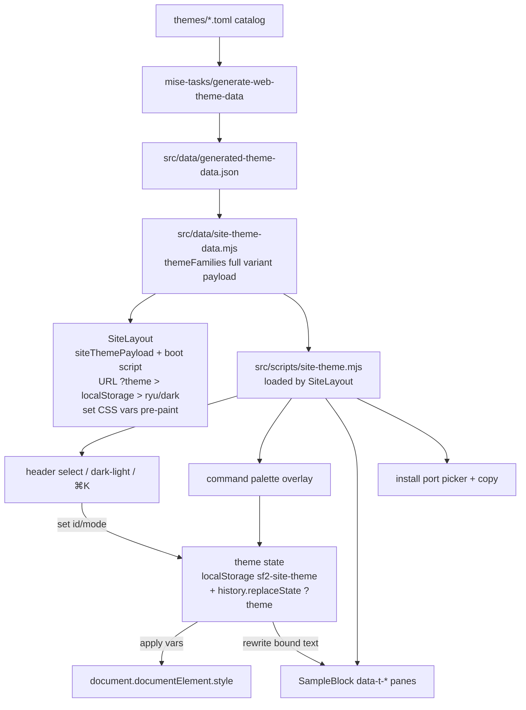

## Goal Capsule

- **Objective:** Replace the current Archivo-style multi-page Astro site with the approved all-mono single-page design (DC v2 export + SampleBlock).
- **Means:** Rewrite the home page and site chrome around a full-palette CSS-variable payload; remove routes the design no longer surfaces (with redirect stubs preserving inbound links); keep the game route untouched.
- **Authority:** The DC design exports (`SF2 Themes v2.dc.html`, `SampleBlock.dc.html`) and the approved task brief; the theme catalog in `themes/` remains the data source of truth.
- **Execution profile:** ce-work inline/subagent execution; sequential units; E2E + unit coverage updated in the same change.
- **Stop conditions:** Design-source ambiguity is resolved by the `v2` export being final; any other large surface decision the design does not answer goes to the coordinator via the task return channel.
- **Landing:** Commit on `sum/t-05ad1b8204a9`; PR creation only if the coordinator delegates it (worker procedure) despite the brief's open-PR language.

---

## Product Contract

### Summary

`web/` becomes a one-page site in the design's flat, all-monospace aesthetic: IBM Plex Mono body, markdown-style `#`/`##` headings, a 760px single column, sections for hero, live theme preview, install, and ports, with the whole page restyled by the selected catalog theme. The multi-page routes the design's own nav does not surface (`themes/`, `palette/`, `preview/`, `install/`) collapse into thin redirect stubs that land on the equivalent home section or deep link; `game/` and `404` survive under the new chrome.

### Problem Frame

The current site (`index.astro` + five supporting routes) implements an earlier Archivo Black "SUPPORT PICKER" design — ANSI-tinted 3D cards, multi-page navigation. The new design is a deliberate aesthetic change: quieter, mono-only, content-first, and organized as one scrollable page with in-page anchors (`install`, `ports`) and a `⌘K` command palette instead of separate routes. Keeping both designs half-applied would be incoherent; the design intends a replacement, not an overlay. Because the old routes are indexed and shareable, removal preserves their inbound links as redirects rather than hard-404ing them.

### Requirements

**Page and layout**

- R1. `/` renders the v2 design end to end: brand header, hero (`# Fight for your terminal.`), `## {Fighter} — {Stage}` preview section, `## Install`, `## Ports`, and the Capcom-disclaimer footer. Body is IBM Plex Mono 14px/1.65 on a max-width-760px column; headings render muted `#`/`##` prefixes per the design's markup. The hero sentence and meta line name all seven real app targets (`36 themes · 7 apps`).
- R2. Every painted surface consumes CSS custom properties set from the selected theme — the v2 export's exact set: `--bg`, `--surface`, `--border`, `--line` (mirrors `border` per the export's `applyVars`), `--fg`, `--muted`, `--subtle`, `--accent`, `--accent2`, `--sel`, `--orange`, and ANSI `--c0`–`--c15` — with `color-scheme` tracking dark/light.
- R3. Static HTML is complete and useful without JavaScript: all text content, commands, and the default theme's interpolated values render server-side; controls upgrade progressively.
- R4. At narrow widths the header wraps its controls below the brand/nav row (flex-wrap per the export), the SampleBlock tab bar and panes scroll horizontally, the port picker wraps, and the palette overlay sizes to `min(580px, 92vw)`.

**Theme switching**

- R5. Theme state is `{id, mode}` persisted to `localStorage` under `sf2-site-theme` and restored before first paint — no flash of wrong palette; initial default is Ryu dark per the design.
- R6. Theme state is URL-addressable: `?theme=<family-id>` (optionally `&mode=light`) on `/` overrides the stored preference at boot and on first load, and switching themes updates the URL via `history.replaceState` — mirroring the existing `/game/?theme=` convention so every theme stays shareable.
- R7. Header controls render site-wide: a fighter `<select>` listing the 18 catalog families (option `value` = family id, label = display name), a Dark/Light segmented toggle, and a `⌘K` button. The select and toggle work on every route; the global `←`/`→`/`t` shortcuts and `⌘K` overlay are suppressed on `/game/` (the arcade cabinet owns keyboard input) — marked by a `data-game-route` hook.
- R8. A `⌘K`/`Ctrl+K` command palette lists all 36 dark/light entries (18 families × 2 modes) with 5-stripe swatches, fuzzy multi-word matching including the `boxer`/`claw`/`dictator` aliases, ArrowUp/Down navigation, Enter to apply, Escape to close, and a "Switch to light/dark mode" meta entry with `◐` glyph and `t` sub-label. On open the filter input takes focus; backdrop click or a second `⌘K` closes; hover syncs selection; the active entry is suffixed `· current`; a zero-match query renders the muted text `No fighter by that name. Try ryu, boxer, or light.`; the overlay shows the footer hint bar `↑↓ move · ↵ select · esc close · outside: ← → fighter · t mode`.
- R9. Keyboard: `←`/`→` step through families (preserving mode), `t` toggles dark/light; ignored while typing in inputs/selects and suppressed on the game route per R7.

**Preview, install, ports**

- R10. The preview panel is the SampleBlock: tabs `shell · neovim · python · toml · diff · prose · ansi`, content bound to the active theme (display name, `sf2-<catalog-id>` file id, stage, hexes, ANSI ramp rows), footer showing `{fileId} · {mode}` and the `← → fighter · t mode · ⌘K search` hint.
- R11. The preview section shows the active family's heading (`## Ryu — Suzaku Castle`), file id, and the full 16-swatch ANSI grid.
- R12. Install section: "Three rounds. Pick your app:" with a port picker; per port, three steps (`Round 1` get the CLI via `uvx`, `Round 2` `setup <port>`, `Round 3` `apply <port> --theme <catalogId>`) in command bars, each with a copy button that shows `copied` feedback; a per-port note line. Command bars display the short `sf2-themes <sub>` form but the clipboard payload is the full `uvx --from git+https://github.com/douglasjarquin/sf2-themes.git sf2-themes <sub>` form; each port note ends with `Copied commands include the uvx prefix.`
- R13. Copy buttons feature-detect `navigator.clipboard`, hide where unsupported, and show `copied` only after `writeText` resolves — the export's swallow-and-confirm behavior is overridden by `web/AGENTS.md`'s fallback contract.
- R14. Ports section: a grid of every supported app target (all 7) with a one-line description, plus the "Missing your app? Challenge us with an issue ↗" link.

**Site integrity**

- R15. The replaced routes are removed as content but keep landing stubs: `install/` → `/#install`, `themes/` → `/#preview`, `palette/` → `/#preview`, `preview/` → `/#preview`, and `themes/<id>/` → `/?theme=<id>` — thin static meta-refresh pages marked `noindex` with a canonical link to the destination, so ~24 currently indexed URLs keep resolving. `sitemap.xml`, `llms.txt`, and `INDEXABLE_PATHS` list only the canonical routes (`/`, `/game/`).
- R16. `/game/` and `/404/` keep working, styled by the new chrome and theme variables; the game's own internals and arcade typography are untouched (its `--font-display` stays loaded where the game page needs it).
- R17. The site's palette data flows from the existing pipeline — `themes/*.toml` → `mise-tasks/generate-web-theme-data` → `generated-theme-data.json` → `site-theme-data.mjs` → the inline `siteThemePayload` script — with no second palette data source introduced; every design palette id maps to a catalog entry.
- R18. Accessibility per `web/AGENTS.md`: `:focus-visible` states, `aria-pressed`/`aria-selected`/`aria-expanded` on interactive controls, `aria-label` on icon-only buttons, `prefers-reduced-motion` disables non-essential motion, logical `main`/`nav`/`footer` landmarks preserved.

### Key Decisions

- **Design authority** — the DC v2 export plus `SampleBlock.dc.html` is the target. The earlier `SF2 Themes.dc.html` (v1: sidebar layout, IBM Plex Sans + Source Serif 4, grid cards) is superseded; v2 is self-described as the final iteration. *(settled: user-directed — the brief names the exports as the design source; v2 is the latest of them.)*
- **Single-page site** — the design's nav is in-page anchors (`install`, `ports`) plus GitHub; nothing in it references `themes/`, `palette/`, `preview/`, or an `install/` route. Those routes go away as content rather than being silently restyled with invented design. See Assumptions — the one consequential call the design leaves implicit.
- **Deep links and redirects preserved** — removal deletes pages, not addresses. `?theme=` on `/` replaces per-theme URLs for sharing, and meta-refresh stubs keep indexed old URLs landing somewhere sane. Governs R6, R15. *(session-settled: user-directed — chosen over hard-404ing ~24 indexed URLs: the gallery's shareable-link function is existing product behavior the design never asked to remove.)*
- **Catalog truth over design copy for ports** — the design's PORTS data lists 5 apps and the hero claims "5 ports"; the real CLI ships 7 targets (adds `lazygit` and `claude`, per `src/sf2_theme/cli.py` `APP_NAMES` and `README.md` "Seven apps"). The site lists all 7 with copy in the design's register, the hero names all seven, and `seo.mjs` descriptions are updated to match.

### Scope Boundaries

- Game (`web/src/pages/game/`, `web/src/game/`, `web/src/components/ArcadeGame.astro`) untouched except for the shared layout/CSS/fonts it inherits.
- Python package, adapters, theme catalog, and `mise-tasks/` generators untouched — no regenerated artifacts needed.
- The design's `data/sf2-palettes.json` is a rendering of catalog data, not a new data file; it is not vendored into `web/src`.
- V1 design export ignored except where it explains tokens (`--line`, kept in v2, mirrors `border`; `--tint` is v1-only and was dropped — do not invent it).
- No new JS framework or client-side framework dependency; the site keeps its vanilla-script pattern.

### Sources

- Design exports: `/tmp/sum-t-05ad1b8204a9/design/` (`SF2 Themes v2.dc.html`, `SampleBlock.dc.html`, `sf2-palettes.json`, plus v1 for token provenance). Original copies also remain at `~/Downloads/design-sf2`.
- Existing site plumbing: `web/src/data/site-theme-data.mjs`, `theme-data.mjs`, `generated-theme-data.json`, `web/src/layouts/SiteLayout.astro` inline boot script (`siteThemePayload`).
- CLI ground truth: `src/sf2_theme/cli.py` `APP_NAMES`, `README.md`, `docs/sf2-themes/setup-and-apply.md`.

---

## Planning Contract

### Key Technical Decisions

- KTD1. **Full-variant JSON payload.** The inline `siteThemePayload` script tag (built in `SiteLayout.astro` frontmatter from `themeFamilies` in `site-theme-data.mjs`) switches from the current per-variant shape `{id,name,world,dark/light:{uiValues,accent,secondary,ansi}}` to a complete variant map — `families: [{id,name,stage,aliases,dark:{bg,surface,border,fg,muted,subtle,accent,accent2,sel,cursor,orange,n:[8],b:[8]},light:{…}}]` — matching the design's `data/sf2-palettes.json` entry shape. One payload serves the boot script, header controls, preview panes, command palette, and redirect-stub lookup. The `themeFamilies` export keeps its name (consumed by `lib/seo.mjs`, `SiteHeader`, `FeaturedPalettePreview`, `themes/` pages until U4 deletes them). *(session-settled: user-directed — chosen over keeping the slot payload plus a second per-page data path: one contract authority, and the design needs full ANSI ramps everywhere.)*
- KTD2. **Data-bound static panes.** SampleBlock tab panes render as server-side HTML for the default theme with `data-t-*` attributes marking interpolated values; the client script rewrites text on theme switch. No client templating library, no re-render of static structure. *(session-settled: user-directed — chosen over JS-driven DOM construction: keeps R3's no-JS completeness and matches the site's existing inline-script pattern.)*
- KTD3. **One client module, loaded by the layout.** All theme behavior lives in a bundled module (`src/scripts/site-theme.mjs`) loaded by `SiteLayout.astro` so header controls work on every surviving route; index-only behaviors (SampleBlock `data-t-*` rewrite, port picker, install copy) are presence-guarded, and global key handlers are gated on `data-game-route` absence so the arcade cabinet's arrow-key input is never preempted. The `⌘K` overlay markup lives in `SiteLayout` (component `SiteCommandPalette.astro`) so it opens from any non-game route. *(session-settled: user-directed — chosen over a home-only module that leaves header controls inert on `/game/` and `/404/`.)*
- KTD4. **Keep the `sf2-site-theme` storage key.** Existing visitors keep their saved theme instead of resetting; shape stays `{id,mode}` so migration is free. *(session-settled: user-directed — chosen over the design's scratch `sf2-v2-state` key: preserving saved preference is invisible-only difference from the export.)*
- KTD5. **Redirect stubs for removed routes.** `themes/[id].astro` survives as a `getStaticPaths` stub page (meta-refresh + canonical + noindex) pointing at `/?theme=<id>`; `install/`, `palette/`, `preview/`, `themes/` each become a one-line stub to the matching home anchor. GitHub Pages cannot 301; stubs are the cheapest correct preservation. *(session-settled: user-directed — chosen over hard 404s: preserves inbound links and the indexed surface without keeping the pages.)*

### High-Level Technical Design



### Assumptions

- **Route removal.** The plan replaces `/themes/`, `/palette/`, `/preview/`, `/install/` content with redirect stubs, judging the design a whole-site replacement. Flagged for coordinator review: if subpages should be kept under the new chrome instead, that is extra work the design never specified.
- **`⌘K` palette replaces the v1 dropdown grid** — v2 removed the `more` panel in favor of the overlay; the header `<select>` covers the accessible fallback.
- **Fonts:** IBM Plex Mono (400/600/italic) is the body font. JetBrains Mono and Geist Mono appear in the v2 font link but are never referenced by its CSS — canvas props, not page fonts; not loaded. Archivo Black stays loaded for `/game/` arcade typography only.
- **`--cursor` is data, not a var** — the design's theme objects carry a `cursor` field but `applyVars` never sets `--cursor`; SampleBlock uses `--accent`/`--sel` for cursor visuals. Payload keeps the field; the boot script applies exactly the design's var list.
- **Port copy for `lazygit` and `claude`** is written in the design's terse register; no design input exists for their exact phrasing (flagged in the report for copy review).
- **Default selection** is Ryu dark (the design's fetch-time fallback), so first-time visitors see Ryu rather than main.
- **`data-theme`/`data-family` on `<html>`** are retained for e2e selectors and `[data-mode]` CSS hooks; e2e is their named consumer.

### Sequencing

```text
U1 payload+boot+tokens → U2 chrome → U3 home page+behavior → U4 route stubs+metadata → U5 tests
```

U4 depends on U3 (home replaces what those routes did) and U2 (site chrome shared by stubs and surviving routes); U5 last so specs validate the final surface.

---

## Implementation Units

### U1. Theme payload, boot script, and global tokens

- **Goal:** Give every surface the full palette (UI tokens + ANSI ramp + meta) and re-skin `global.css` on the new variable set without breaking the surviving routes.
- **Files:** `web/src/data/site-theme-data.mjs`, `web/src/layouts/SiteLayout.astro`, `web/src/styles/global.css`, `web/test/theme-data.test.mjs` (or sibling — add payload-shape assertions).
- **Patterns:** In `site-theme-data.mjs`, extend each `themeFamilies` entry's `dark`/`light` variants to the full field set (`bg,surface,border,fg,muted,subtle,accent,accent2,sel,cursor,orange,n[8],b[8]` plus `id,name,stage,aliases` meta) from `paletteVariants`/`themeTokens`. In `SiteLayout.astro`, swap the font link to `IBM+Plex+Mono:ital,wght@0,400;0,600;1,400`, keep the Archivo Black link only where `/game/` needs it (head slot or the game page's own link), and rewrite the inline boot script: resolve selection as `?theme`/`&mode` URL params → `localStorage["sf2-site-theme"]` → `ryu`/`dark`; set `--bg --surface --border --line(border) --fg --muted --subtle --accent --accent2 --sel --orange --c0-15`, `colorScheme`, and `data-theme`/`data-family` on `<html>`; tolerate corrupt JSON. Rewrite `global.css` base tokens/typography (mono body, `#`/`##` heading convention, selection `var(--sel)`) while retaining the structural layer — `--space-*`, type scale, `--radius-*`, `--duration-*`, `--font-mono`, and every `--color-*` semantic alias remapped onto the new vars (e.g. `--color-cyan: var(--c6)`, `--color-surface-0: var(--surface)`, `--font-display` still defined) — so `/game/` and `/404/` keep resolving. Grep `web/src` for `var(--` consumers before deleting any renamed token.
- **Test scenarios:**
  - Payload unit test: every family has `dark`/`light` variants, each with 8 `n` + 8 `b` hexes and all UI tokens as `#[0-9a-f]{6}`.
  - Boot: with `localStorage.sf2-site-theme={"id":"m-bison","mode":"light"}` the page paints `--bg`/`--c15` matching the `m-bison-light` catalog values before the module script runs (computed-style e2e).
  - `/?theme=vega&mode=light` overrides stored state and paints `vega-light` values.
  - Corrupt storage (`sf2-site-theme=not-json`) → defaults to ryu dark without throwing.
- **Verification:** `cd web && node --test test/` for unit; e2e coverage lands in U5.

### U2. Site chrome — header, footer, chrome styles

- **Goal:** Header and footer match the design and work on every surviving route: brand `sf2-themes`, root-absolute nav anchors, fighter select, dark/light toggle, `⌘K` button, single-line disclaimer footer.
- **Files:** `web/src/components/SiteHeader.astro`, `web/src/components/SiteFooter.astro`, `web/src/components/SiteCommandPalette.astro` (new; overlay markup hosted by SiteLayout), `web/src/styles/site-chrome.css`, `web/src/layouts/SiteLayout.astro` (skip-link, `data-game-route` hook, module load).
- **Patterns:** Header: `<a class="brand">`; `nav` items `install`, `ports`, `github ↗` rendered as `${sitePath()}#install` / `${sitePath()}#ports` so they resolve to the home page from `/game/` and `/404/`; controls = `<select>` with `option` per family (`value={id}`, label `{name}`), segmented `.modes` `dark`/`light`, `.cmdk` button `⌘ K`. Footer: Capcom fan-tribute disclaimer + GitHub/issues links. Palette overlay markup per R8.
- **Test scenarios:**
  - Header renders 18 select options in catalog order; current family pre-selected; option labels show display names.
  - `dark`/`light` buttons expose `aria-pressed`; `⌘K` button has `aria-label` and `aria-expanded`.
  - On `/game/`, the select and dark/light toggle still switch the site theme; `←`/`→`/`t`/`⌘K` do not fire while the game root is present.
  - Footer contains the Capcom disclaimer text from the design.
- **Verification:** e2e in U5; `mise run web:check` for markup/a11y basics.

### U3. Home page: sections, SampleBlock, command palette, interactions

- **Goal:** `index.astro` renders the entire v2 page and its client behavior.
- **Files:** `web/src/pages/index.astro`, `web/src/components/SampleBlock.astro` (new), `web/src/scripts/site-theme.mjs` (new module; loaded by SiteLayout per KTD3), `web/src/styles/global.css` or a new `web/src/styles/home.css` for page rules.
- **Patterns:** Sections in design order: hero → `## {name} — {stage}` + fileId + 16-swatch ANSI grid → SampleBlock (tabs + 7 panes from `SampleBlock.dc.html`, values via `data-t-*` spans for `t.name`, `t.fileId`, `t.stage`, `t.mode`, `t.bg`, `t.fg`, `t.surface`, `t.accent`, `t.n1`, `t.b5`, etc.) → `## Install` (port picker + 3 rounds + notes; short-form display, `uvx`-prefixed clipboard payload per R12/R13) → `## Ports` (7-app rows) → footer (layout). Section anchors are `id="preview"` (theme section), `id="install"`, `id="ports"` — the export's `install-a`/`ports-a` suffixes were canvas-scoping artifacts; the real ids are what the nav and redirect stubs target. `site-theme.mjs`: `getState`/`setState` (localStorage + `history.replaceState` `?theme`), `applyTheme(variant)` (vars + `colorScheme` + `dataset` + rewrite `data-t-*` text + `--theme` arg in apply commands + control sync), keyboard handler (R7/R9), palette open/close/filter/select per R8, port picker, clipboard copy with feature-detection and post-resolve `copied`.
- **Test scenarios:**
  - Select "Blanka" → `--bg` equals the `blanka` dark bg, heading shows `## Blanka — …`, SampleBlock footer shows `sf2-blanka · dark`, URL gains `?theme=blanka`.
  - `t` toggles mode; `←`/`→` move family; focus inside the family `<select>` is not hijacked.
  - `⌘K` opens overlay with focus in the input; `boxer` filters to Balrog entries; hover moves selection; `Enter` applies; `Esc` closes and restores focus; a nonsense query shows `No fighter by that name. Try ryu, boxer, or light.`
  - Port picker `nvim` displays `sf2-themes setup nvim` / `apply nvim --theme ryu`; copying writes the `uvx --from …` prefixed command and shows `copied`; switching theme updates the `--theme` argument and the URL.
  - ANSI grid renders 16 chips; `ansi` tab shows two labeled ramps (normal/bright) using `--c0-15`.
  - Mobile viewport (375px): header controls wrap below nav, tab bar scrolls, port picker wraps, palette fits viewport.
- **Verification:** e2e in U5.

### U4. Route stubs and site-metadata reconciliation

- **Goal:** Remove replaced pages/components/styles; leave redirect stubs; make sitemap/llms/seo truth.
- **Files:** delete `web/src/components/FeaturedPalettePreview.astro`, `web/src/components/PalettePreview.astro`, `web/src/styles/palette-preview.css`, `web/src/scripts/palette-preview-runtime.mjs`; replace `web/src/pages/themes/index.astro`, `web/src/pages/themes/[id].astro`, `web/src/pages/install/index.astro`, `web/src/pages/palette/index.astro`, `web/src/pages/preview/index.astro` with meta-refresh stubs (`noindex`, canonical link, instant redirect + visible fallback link — `themes/[id]` keeps `getStaticPaths` per family → `/?theme=<id>`); edit `web/src/pages/404.astro` (nav targets), `web/src/lib/seo.mjs` (`INDEXABLE_PATHS`, `llmsTxt` Pages list, `PRODUCT_DESCRIPTION` all seven apps), `web/public/sitemap.xml`, `web/public/llms.txt`, `docs/game-architecture.md` (route descriptions), `DESIGN.md` (PageBreadcrumb variant references). Keep `web/src/components/PageBreadcrumb.astro` — `/game/` still uses it; restyle its `.crumb` rules to the new tokens.
- **Patterns:** `public/sitemap.xml`, `public/llms.txt`, `public/robots.txt` are committed files whose content `web/tests/unit/seo.test.mjs` asserts equals the `sitemapXml()`/`llmsTxt()`/`robotsTxt()` generators — regenerate by writing the function output, not by hand-editing the files. `INDEXABLE_PATHS` becomes `[SITE_BASE, `${SITE_BASE}game/`]`; stubs are excluded from it and carry `noindex`. Grep code and prose (`docs/`, root Markdown) for `/themes/`, `/palette/`, `/preview/`, `/install/` references before finishing. Stub redirects: `install/`→`/#install`, `themes/`→`/#preview`, `themes/<id>/`→`/?theme=<id>`, `palette/`→`/#preview`, `preview/`→`/#preview`.
- **Test scenarios:** none — removal unit, verified by U5's updated shell/static-site specs and clean build (broken imports fail `web:check`/`web:build`).
- **Verification:** `mise run web:build` produces the surviving route set plus stub pages.

### U5. Test suite reconciliation

- **Goal:** E2E + unit coverage matches the new surface; no specs asserting removed-page content remain.
- **Files:** `web/tests/e2e/` — rewrite `home.spec.mjs` (design behaviors incl. U3 scenarios), `shell.spec.mjs` (header/nav/404 + stub-redirect assertions), `static-site.spec.mjs` (canonical index + game), `new-design.spec.mjs` (replace with the v2 contract or merge into `home.spec.mjs`); delete `install.spec.mjs`, `palette.spec.mjs`, `preview.spec.mjs`, `themes.spec.mjs` (redirect coverage moves into `shell.spec.mjs`); keep `game.spec.mjs` untouched; `web/test/browser-game-host.test.mjs`, `web/tests/unit/seo.test.mjs`, `web/test/palette-mapping.test.mjs`, `web/test/palette-terminal-mapping.test.mjs`, `web/test/theme-data.test.mjs` (update references to removed components/paths as needed).
- **Patterns:** Follow existing spec conventions (relative `./` paths; baseURL carries `/sf2-themes`); assert computed CSS vars for theme switching, not screenshots.
- **Test scenarios:** (this unit IS the test layer) — covered by each spec above.
- **Verification:** `mise run web:test` (unit + e2e) green.

---

## Verification Contract

| Command | Scope | When |
|---|---|---|
| `mise run web:install` | web deps | once, before check/test |
| `mise run web:check` | Astro/TS diagnostics | after every unit batch |
| `mise run web:build` | static build, route graph | after U4 and before DoD |
| `mise run web:test` | unit + Playwright e2e | final gate |
| `uv run --with pytest pytest` | Python suite (unchanged surface, brief requires it) | final gate |
| `ruff check src tests scripts` / `ruff format src tests scripts` | Python hygiene (brief lists them; expect clean no-ops) | final gate |

No repository-owned `verify` task exists (inherited only); the table above is the contract. Report each command with its observed exit code.

## Definition of Done

- `/` renders the v2 design: mono type, 760px column, hero, preview+SampleBlock, install rounds with copy, ports grid, disclaimer footer.
- Theme switching works via select, dark/light toggle, `⌘K` palette, and `←`/`→`/`t`; choice persists across reloads with no wrong-palette flash and is shareable via `?theme=`.
- All painted colors derive from catalog-driven CSS vars; no hardcoded theme palette besides the design's own token naming.
- Removed routes redirect to their home equivalents (`themes/<id>/` → `/?theme=<id>`); `game/` still passes `game.spec.mjs` unmodified; sitemap/llms/seo agree on the canonical routes.
- No `sf2-palettes.json` or second palette source vendored; every design palette id resolves to a `themes/` catalog entry (all 36 do).
- Every command in the Verification Contract ran, exit codes recorded; nothing untested is claimed.

## Appendix

- Design exports (read-only reference): `/tmp/sum-t-05ad1b8204a9/design/` (stable copies; originals at `~/Downloads/design-sf2`).
- Design palette ids = 18 family ids × dark/light = 36 entries; mapping verified 1:1 against `generated-theme-data.json` `themes[].meta.id` (each `<id>` and `<id>-light`).
